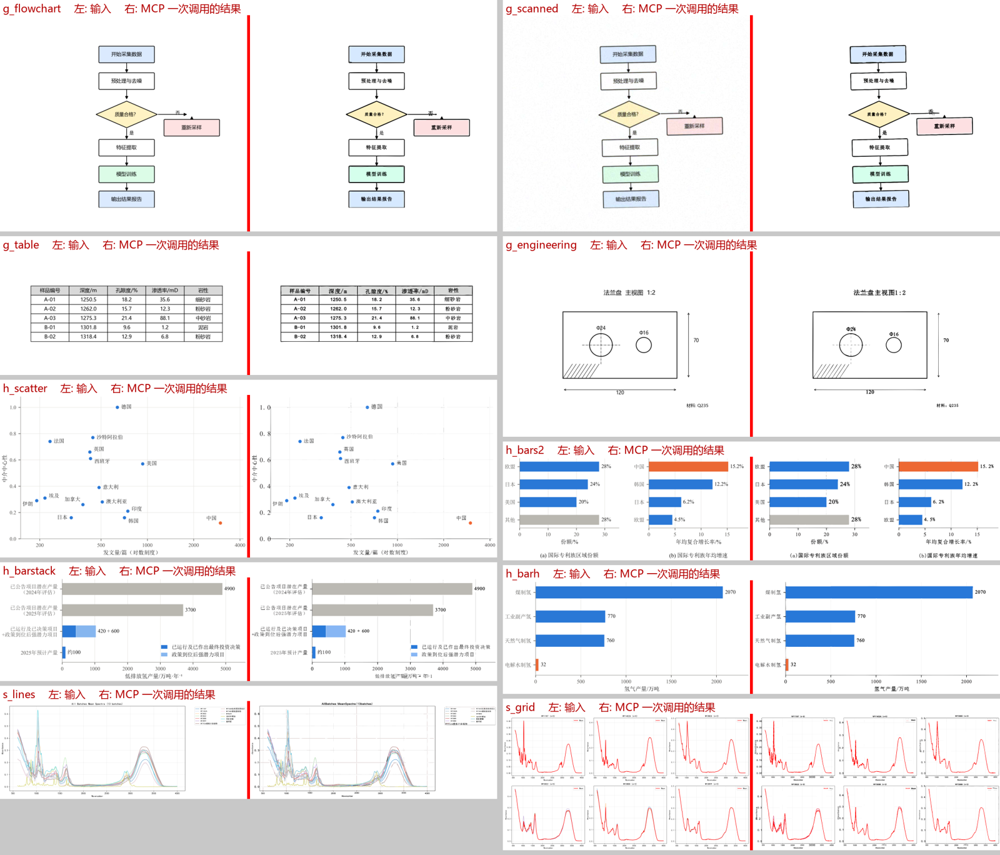
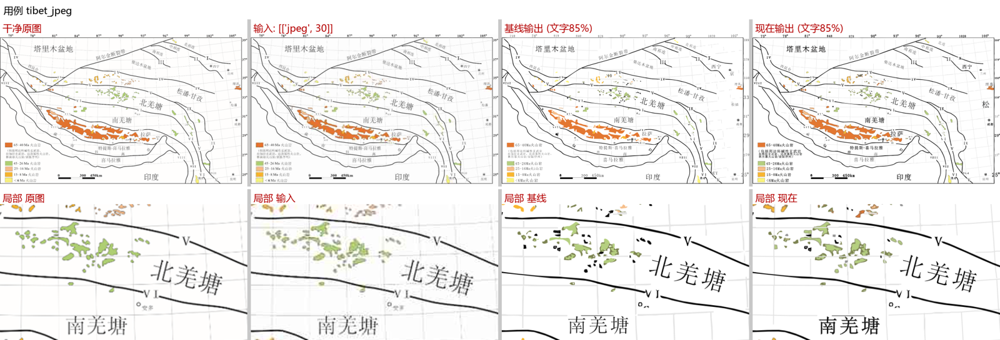
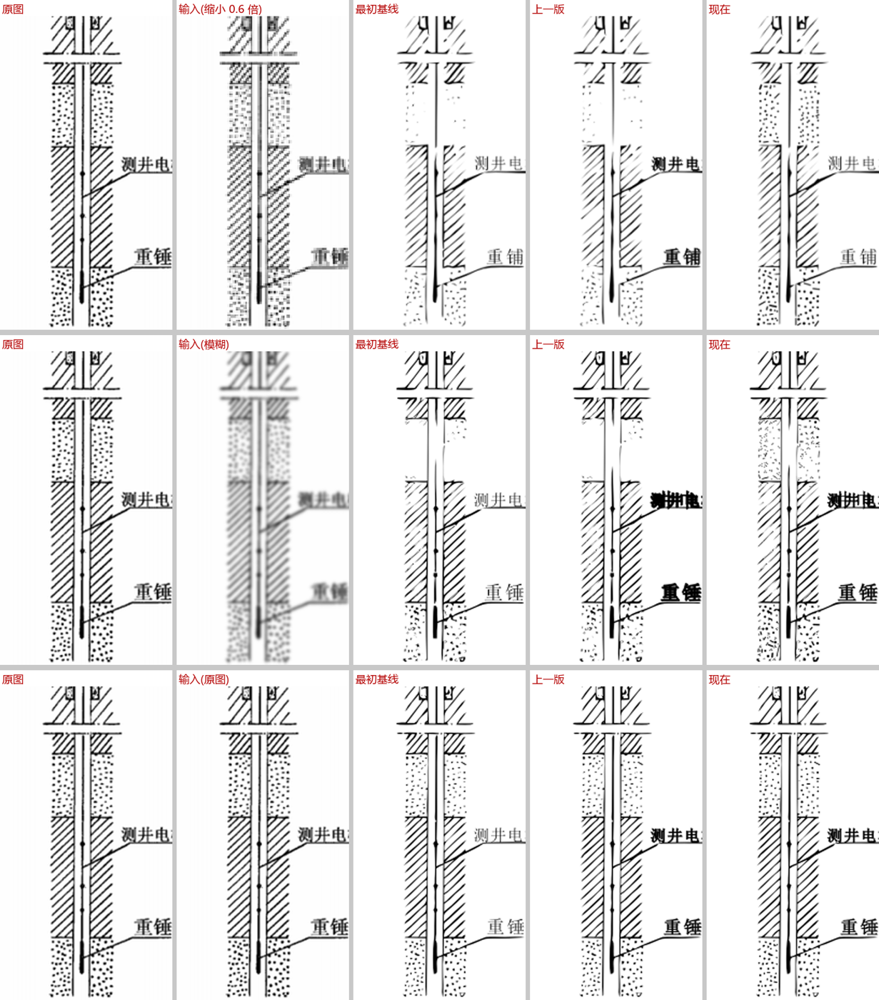

# coreldraw-vectorize-mcp

把位图（示意图、地质图、图表、流程图、表格、扫描件……）**一次调用**转成**可编辑的 CorelDRAW 矢量文件**的 MCP 服务器。
线条、色块、网格是矢量曲线，文字是可编辑的文本对象；模糊、缩小、JPEG 压缩过的图也能处理。
结果中拿不准的地方会**报告给调用它的 AI**，由 AI 核对修正后一键重建。

*An MCP server that turns raster drawings (diagrams, maps, charts, flowcharts, tables, scans) into editable
CorelDRAW vector files in one call: traced linework and colour regions, re-created editable text, and a
self-check that reports anything uncertain back to the calling AI so it can fix and rebuild.*



<sub>10 张 MCP 开发时从未针对其调参的图：每组左为输入，右为一次调用、无人工修正的结果。</sub>

## 功能

- **两条处理路径，自动选择**（见下方[处理路径](#处理路径)）：以色块为主的示意图（剖面图、填色地图）走**区域模型**，
  每个色块画成一个完整的矢量形状；流程图、图表、表格、扫描件、线稿、带点状/线状纹理的地图走**分层描摹**
- **一次调用**：`cdr_vectorize(image_path)` 完成超分辨率、OCR、分层描摹、文字重建，输出 `result.cdr` + `result.png`
- **自动判断模式**：彩色（色块/填充/网格分层）或黑白线稿
- **文字变成可编辑文本**：多尺度 OCR 投票；支持斜排、竖排文字；粘连的多个标签自动拆分；中文用新宋体，数字/英文按原图比对选 Times New Roman 或 Arial；按原图笔画粗细模拟加粗
- **适应低质量输入**：Real-ESRGAN 超分；大图自动缩放；扫描件纸张底色校正；JPEG 褪色色块按色相找回
- **细节保真**：网格线识别为矢量折线；PowerTRACE 会丢掉的点状填充、短剖面线直接画成矢量
- **细线画成中心线描边**：整层都是细线的色层（断层线、等值线）不走轮廓描摹——轮廓描摹会把 2px 的线
  变成一个填充的长条，还带一圈描边。判据：≥70% 面积属于长连通域、平均线宽 ≤3.5px
- **分块描摹 + 描摹后补线**：PowerTRACE 的细节阈值是相对整幅位图的，2px 的线在 2048px 宽的图里只占 0.1%，
  会被当噪点丢掉。墨线层按约 900px 分块描摹（`CDR_TILE_PX`，`CDR_NO_TILE_TRACE=1` 关闭）；
  画完再和墨线层比对一次，把漏掉的细长线按中心线补回
- **彩色文字**：颜色从原图前景分割取得（不再一律变黑）；擦除时保护穿过文字的异色线条，
  并在 inpaint 之后把它们贴回；被文字压住的黑线按共线规则接回
- **色块描边只在真有描边时才画**：判据是"边界上没被其它线条画到的那部分是否确实有细暗线"，
  否则虚线边界会被画成实线、断层两侧会多出棕边
- **斜排标签裁剪摆正重读**：检测器沿水平方向切，会把斜排词切碎并丢掉开头（Depression→epression）。
  按检测四边形裁出文字条带、旋转摆正、放大后重读；**只接受前缀补全**，其余分歧只标"待核对"
- **自检并报告问题**（`issues`）：图形覆盖率、多余内容、颜色、小元素丢失、描摹失败、文字回读；附差异图（红 = 缺失，蓝 = 多余）
- **图形与文字分开自检**：加字**之前**先在纯图形结果上检查一次（`graphics_issues`），再加字检查文字（`text_issues`）。
  混在一起时，"线丢了"和"文字盖住了线"看起来一模一样，修法却完全不同
- **擦字审计**（`wipe_spill`）：标签框同时也是"从底图上擦掉哪些像素"的定义，报告它是否把线稿一起擦掉了。
  它只覆盖墨层那次擦除；彩色文字的那次擦除走 inpaint，`wipe_spill` 结构上看不到，
  那一路的规模由 `layers.json` 的 `wipe_colour_px` 给出
- **放置参数前置**（`label_placement`）：每个标签的字号 / 角度 / 位置 / 颜色在描摹之前就算好并返回，可直接核对
- **图和差异图直接返回**：`review_sheet` 等以 MCP 图片内容进入调用方的上下文，不依赖它自己去打开文件
- **核对图**（`review_sheet`）：把不确定的文字（L#）和可能漏识别的文字（M#）拼成一张图，AI 看一张图就能核对





## 处理路径

### 区域模型（`cdr_flat.py`，色块示意图）

分层描摹把图按颜色拆成十几张蒙版，每张交给 PowerTRACE 单独描摹。它不知道图里有哪些区域、谁和谁相邻，
在色块示意图上会出现三类问题：两个色块交界处的抗锯齿过渡像素被归进某个颜色，描成成百上千个碎片；
相邻色块各自描边，边缘对不齐，露出白缝；虚线每一小段都成了一个形状。一张约 200 个对象的地质剖面图
曾被描成 2274 条曲线 + 753 条折线。

区域模型先理解结构，再输出矢量：

1. **调色板只取「平坦」像素**（3×3 邻域颜色一致），过渡色从一开始就进不了调色板
2. **文字**：OCR 框内，凡不是框周围背景色的像素都算文字（含浅灰抗锯齿边）；
   与标签同色的像素无论连着什么都算文字；从框里延伸出去的连续线条才算真实线条
3. **区域分割**：以区域色为种子做分水岭，文字、线条、过渡像素不做种子，区域从两侧长过去、
   在颜色边缘相遇——每个像素只属于一个区域，没有碎片、没有空隙、文字下面也不留残影
4. **亚像素边缘**：在 2 倍双三次放大的图上，把边界像素归给「在两色混合线上更近」的一侧，
   边界落在原图抗锯齿边的真实位置
5. **线条**：区域解释不了、也不是两个相邻区域混合色的像素才是线条；贴着区域边界的深色边
   作为**区域的轮廓线**（不单独成对象），其余按核心颜色分组：共线的短段识别为**虚线**
   （一条直线 + 虚线线型），其余画成中心线
6. **CorelDRAW 只负责画**：每个区域一个带洞的贝塞尔形状，直接创建，不再调用 PowerTRACE，
   COM 调用少很多，也更快

同一张剖面图：77 个区域形状 + 224 条线（其中 21 条虚线）+ 19 个文字，CorelDRAW 步骤约 50 秒
（分层描摹约 150–190 秒）。

**自动选择**：`flat_score()` 同时满足以下条件才走区域模型——平坦像素覆盖 ≥80%、几乎没有纹理
（远离平坦区的非平坦像素 ≤1%）、没有密集小斑点（点状填充）、主要颜色 2–24 种、**非白色面积 ≥50%**。
流程图、图表、表格是白底上的线条和小色块，区域模型在它们上面实测更差（流程图的箭头全部丢失），
因此仍走分层描摹。环境变量 `CDR_FLAT=1` 强制使用区域模型，`CDR_FLAT=0` 禁用。
结果写在 `layers.json` 的 `flat` / `flat_score` 字段里。

### 分层描摹（`cdr_vectorize_color.py`，其余所有图）

按调色板分层、逐层 PowerTRACE，外加点状填充、网格线、细线中心线、分块描摹等专门处理，见上方功能列表。

## 环境要求

| 项 | 说明 |
|---|---|
| 系统 | Windows（通过 COM 驱动 CorelDRAW） |
| CorelDRAW | 已在 **CorelDRAW Graphics Suite 2022（v24）** 上验证；使用前需先手动打开 CorelDRAW 窗口 |
| Python | 3.11+ |
| Real-ESRGAN | [realesrgan-ncnn-vulkan](https://github.com/xinntao/Real-ESRGAN/releases) Windows 版（需要支持 Vulkan 的显卡） |

## 安装

```bash
git clone https://github.com/cjjjqxx/coreldraw-vectorize-mcp.git
```

```bash
cd coreldraw-vectorize-mcp
```

```bash
python -m venv .venv
```

```bash
.venv\Scripts\pip install -r requirements.txt
```

然后下载 [Real-ESRGAN ncnn-vulkan](https://github.com/xinntao/Real-ESRGAN/releases)（`realesrgan-ncnn-vulkan-*-windows.zip`），解压成：

```
tools/realesrgan/realesrgan-ncnn-vulkan.exe
tools/realesrgan/models/realesrgan-x4plus-anime.*
```

（也可以放在别处，用环境变量 `CDR_TOOLS` 指向包含 `realesrgan/` 的目录。）

## 接入 MCP 客户端

在 Claude Code / Claude Desktop 等客户端的 MCP 配置中加入（路径改成你的）：

```json
{
  "mcpServers": {
    "cdr": {
      "type": "stdio",
      "command": "C:\\path\\to\\coreldraw-vectorize-mcp\\.venv\\Scripts\\python.exe",
      "args": ["C:\\path\\to\\coreldraw-vectorize-mcp\\cdr_server.py"]
    }
  }
}
```

可选环境变量：

| 变量 | 作用 | 默认 |
|---|---|---|
| `CDR_WORK` | 未指定 `work_dir` 时的输出目录 | `~/cdr-vectorize-work` |
| `CDR_TOOLS` | 含 `realesrgan/` 的目录 | 仓库下的 `tools/` |
| `CDR_EXE` | CorelDRAW 可执行文件（装在非默认位置时必须设） | 默认安装路径 |
| `CDR_SR` | 超分倍数。**不设则自动判断**：源图 ×2 若超过 6 MP 工作上限就用 1 | 自动 |
| `CDR_NO_MEASURED_TEXT` | 关掉"按标签自身角度实测文字长度"来定字号 | 关（默认**开**） |
| `CDR_NO_COLOUR_WIPE` | 关掉彩色文字擦除 | 关（默认**开**） |
| `CDR_NO_DASH_PROTECT` | 关掉虚线保护 | 关（默认**开**） |
| `CDR_NO_REOCR` | 关掉局部放大 OCR | 关（默认**开**） |
| `CDR_QUAD_WIPE` | 把擦除范围收窄到 OCR 多边形 | 关 |
| `CDR_EXPERIMENTAL` | 一次性打开全部实验特性 | 关 |

几条默认值背后的原因（都不是拍脑袋定的，都有实测）：

- **`CDR_SR` 自动**：超分只在输入本来就小/糊时有用。大图放大 ×2 会撞上 6 MP 的工作上限，pipeline 随后
  把**源图**缩回去，等于超分白做还倒赔约 60% 的像素、字高直接减半。实测 2048×1824 的地质图：
  S=2 时 OCR 不确定项 31、图形 precision 0.666、丢 23 个元素；**S=1 时 13 / 1.0 / 0**。
- **实测字号默认开**：旋转标签的"字高"若按轴对齐框量，量到的是框对角线，字号会放大成巨字。
  改成沿标签自身角度投影实测后，字号才跟着文字走。它**只影响字号，不碰擦除**。
- **彩色擦除默认开**：蓝字压在蓝色色块上时，那些像素被调色板归为"颜色"而非"墨"，
  ink 擦除根本看不到它们，会留下描摹进色块的幽灵字。关掉就没有任何东西能擦掉它们。
- **虚线保护默认开**：虚线段是短线段，在这个尺度上和文字笔画形状无法区分，会被连同文字一起擦掉。
  识别在前、保护在后。**图形缺失是补不回来的，文字留着还能手改**，所以这项偏向保留。
- **`CDR_QUAD_WIPE` 默认关**：把擦除限制在 OCR 多边形里确实能少伤线稿，但实测擦除面积掉了 58%，
  文字也擦不净了，两边不讨好。

## 使用

### 推荐流程

1. 打开 CorelDRAW。
2. 调用 `cdr_vectorize(image_path)`。**先读返回里的 `workflow`**——它是第一个字段，直接说明这次是「已完成」「只做了一半」还是「还在跑」。然后看：
   - `labels_to_check`：不确定的文字（原因 + 其他可能读法）
   - `unlabeled_text`：疑似没识别出来的文字区域
   - `review_sheet`：一张核对图
   - `graphics_issues`：**加字之前**、在纯图形结果上发现的问题（描摹失败、丢内容、颜色不对、
     标签框擦坏线稿）——修法是 `mode`/`colors`/改框，改文字没用
   - `text_issues`：文字对象本身放错了（重叠、字号、缺字）——修法只在 `labels`
   - `label_placement`：每个标签预先算好的字号 / 角度 / 位置 / 颜色，**在建之前**就能核对
   - `wipe_spill`：某个标签框把线稿当文字擦掉了多少像素（只有改框能救）
   - `issues`：以上图形类与文字类问题的合并列表（兼容旧调用方），`self_check.diff_png` 为差异图
3. 需要修标签时用 `label_patch`，**不要重抄整份 `labels`**：
   ```python
   cdr_vectorize_build(work_dir, label_patch={
       "set": {"L3": "藏"},          # 改这个 L# 的文字（空串 = 不是文字，按图形描摹）
       "drop": ["L7"],               # 删掉这个标签
       "set_box": {"L5": [x0, y0, x1, y1]},
       "add": [{"text": "南", "box": [256, 398, 269, 412], "angle": -90}]})
   ```
   超分和 OCR 结果复用，只重新分层、描摹、放文字。
4. 收敛后调用 `cdr_finish(work_dir)`。**这是交付确认**：只要还有没处理的 L#/M#/图形/文字问题，
   它就返回错误、拒绝确认，并列出还差什么。确实无法自动修的（例如点状填充被误判成文字），
   用 `cdr_finish(work_dir, accept_remaining=True, note="原因")` 交付，但要在答复里如实列出遗留问题。

> **核对图和差异图会以 MCP 图片内容直接返回**，不是只给一个路径。调用方的 AI 不需要自己去打开文件，
> 图就在它的上下文里。服务端同时设置了 MCP `instructions`，支持该字段的客户端会自动拿到上述流程。

### 大图与超时

服务端每一步都有时间预算（`wait_seconds`，默认 45 秒，故意低于常见的 60 秒客户端超时）。
预算用完时它**不会让你空手而归**，而是返回 `done=false` / `status="running"` 和一个 `work_dir`：

```python
cdr_job_status(work_dir)      # 30–60 秒后再调，直到 done=true
```

任务仍在后台跑，`cdr_job_status` 会把一次调用被切断的两步接起来跑完。这不是失败，也不要在同一个图上
重开一次 `cdr_vectorize`。如果你的客户端超时设得更长，可以把 `wait_seconds` 调大，让一次调用同步拿完结果。

> **重要：一次调用只是第一遍。** 请务必处理 `workflow` 报告的问题，否则效果会明显打折扣。
> 完整步骤、每种 issue 的处理方法、CorelDRAW 手工收尾，以及一段可以直接交给 AI 的指令，见
> **[后处理指南](docs/POSTPROCESS.md)**。

### 工具列表

| 工具 | 用途 |
|---|---|
| `cdr_vectorize` | 一次调用完成图片 → CDR（推荐，唯一正路） |
| `cdr_vectorize_prepare` / `cdr_vectorize_build` | 分两步：先超分 + OCR，再按（修正后的）标签生成 |
| `cdr_job_status` | 取回被交接（`status="running"`）的任务结果 |
| `cdr_finish` | 交付确认；还有未处理的核对项时**拒绝确认** |
| `cdr_status`、`cdr_launch` | 环境检查、启动 CorelDRAW |

`cdr_vectorize_build` 的常用参数：

| 参数 | 说明 |
|---|---|
| `label_patch` | 改标签的**首选**方式：`{"set": {"L3": "藏"}, "drop": ["L7"], "add": [...]}`。**每次都基于 prepare 的原始识别结果，不累加**——最后一次重建必须带上此前所有修正 |
| `latin_font` | 强制数字/英文字体（如 `"Times New Roman"`）。不传则按原图自动投票；一张图同时用两种西文字体时（地名衬线、区域名无衬线）只能靠这个参数指定 |
| `colors` | 调色板颜色数，默认 12。**只对分层描摹有效**：区域模型自己从图里取调色板（只统计平坦像素），传 `colors` 不起作用 |
| `skip_uncertain` | 只放置有把握的读数，其余留空给人工 |
| `CDR_EXPOSE_PRIMITIVES=1` 时额外暴露：`cdr_new_document`、`cdr_draw_*`、`cdr_add_text`、`cdr_import_image`、`cdr_export_png`、`cdr_save_document`、`cdr_trace_image`、`cdr_compare`、`cdr_reproduce` | CorelDRAW 基础自动化原语 |

> 底层原语**默认不注册**。二十个工具并排摆着时，分不清主路和原语的调用方会去用 `cdr_trace_image`
> （只描形状、不能重建文字）或者干脆用 `cdr_draw_*` 手画——结果差一个数量级，而且看不出哪里错了。
> 要脚本化调用或调试时，设 `CDR_EXPOSE_PRIMITIVES=1` 把它们放出来。

## 稳定性

CorelDRAW 实例跑久了会停止响应（COM 调用不再返回），而"检查是否可用"本身也是一次 COM 调用，
会跟着卡住。构建前的健康检查因此放在**子进程**里做，带超时：

- 未启动 → 启动一个（有防护，不会起出第二个实例）；
- 无响应 → 杀掉并重启，等到**字体表和建文档接口都真正可用**才继续
  （只等 `Documents.Count` 会在刚启动时通过，随后构建却死在 `FontList` / `CreateDocumentEx` 上）；
- CPU 累计超过 `CDR_CPU_RESTART_S`（默认 1200 秒）→ 在它变慢之前主动重启，省下的是整次构建；
- `CDR_NO_AUTO_RESTART=1` 关闭该行为。重启过的构建会在结果里带 `cdr_restarted`。

实例不是突然卡死，而是**越跑越慢**：同一张 3295×1820 的网格图，CorelDRAW 步骤在刚启动的实例里
84 秒完成，在跑了一整晚的实例里超过 415 秒、直接撞上超时。所以还有两道保险：

- 构建开始前**关掉实例里遗留的文档**——上一次构建若被超时打断，它那份半成品文档还开着，
  越堆越慢；
- COM 步骤超时后**换一个新实例重跑一次**，而不是把一个用户无从下手的失败丢回去。

超时预算按这次构建的真实工作量算：图层数、标签数、**所有**折线（含按中心线描边的色层，
以前漏算了它们）、分块描摹的块数。

## 已知限制

- 中文字体统一用新宋体（按原图自动区分宋体/黑体在常见分辨率下不可靠）。
- **西文衬线/无衬线无法逐标签自动判别**：地名字高只有十来个像素时衬线是亚像素，像素相关和字宽比
  都会按笔画粗细作答。整图按投票选一种，需要时用 `latin_font` 指定。
- **留空的标签不擦原字**：斜排标签测不出长度时会留空给人工（TO FILL 图层的品红框）。
  这类框内的原字**保留为描摹图形**——擦掉它同时会毁掉框内的地图线条，而线条没法补回来，
  多余的图形则是选中删掉就行。
- 标题中的连续空格会丢失（OCR 结果不含空格）。
- 与坐标刻度线相连的小数字可能偏大；这类情况会作为 `text_mismatch` 报告。
- 字高只有六七个像素的极小文字无法可靠识别，会列入核对清单。
- 仅支持 Windows + CorelDRAW；其他 CorelDRAW 版本未测试。
- **区域模型目前只覆盖色块为主的示意图**，自动判定的阈值只在少量图片上校准过；
  实心小箭头、方框边框等在区域模型里还处理不好，所以白底线条类的图仍走分层描摹。
  区域模型中很小的尖锐图形（如锯齿星形）尖角会略显圆钝；小方框（图例色块）的直角仍略圆，
  框内偶尔残留一条多余的浅色细线。
- **区域描边靠实测**：深色线条通常细到没有"平坦像素"，进不了调色板，只能作为区域的轮廓线还原。
  颜色取边界上最暗的 15% 像素，宽度按该形状自己的边界实测（按颜色统一计算会把 2px 的图例边框
  和 1px 的地层边平均成一个值）。JPEG 在饱和色块周围的暗环会被"宽度过细"和"与填充色太接近"两条规则挡掉。
- 自检目前查不出「箭头头部丢失」这类小实心元素的缺失。

## 效果怎么度量

覆盖率、精确率这类面积指标看不出真正的问题：丢光了全部箭头的流程图覆盖率是 0.999，把整个方框涂黑的 bug 也一直报"无问题"——一个箭头只有几十像素，涂黑的方框则是"该有内容的地方有内容"。

`cdr_struct.py` 改为按**元素**比对，调色板取自原图（不用管线自己的聚类）：

| 指标 | 含义 | 能抓到什么 |
|---|---|---|
| `mark_recall` / `missing_significant` | 小元素（箭头、符号、虚线段、边框）是否都被画出来（允许 ±2px） | 丢箭头、丢符号 |
| `ink_extra_share` | 结果比原图明显更暗的像素占比 | 闭合路径被填成黑块、区域盖住邻居 |
| `ink_missing_share` | 反过来：原图的深色内容没画 | 线条被丢掉 |
| `region_iou` | 按颜色算整体面积重叠（不受区域被线切开影响） | 区域颜色错、位置偏 |
| `width_mae` / `width_rel` | 细线实际画出来的宽度误差 | 2px 的边框画成了 0.9px |
| `edge_p75_px` | 源图边界到结果边界的距离分位数 | 边界跑偏、发抖 |

这些结果作为 `graphics_issues` 报告给调用方（`elements_missing` / `ink_extra` / `ink_missing` / `regions_shifted` / `line_width` / `boundary_shift` / `fragmented`）。
阈值按"10 张已知正常的结果零报警、已知有问题的那版必须报警"标定。

`regress/struct_eval.py <work_dir> ...` 可以把任意几次运行拉成一张对比表，用来判断一次改动是进步还是倒退。

## 不靠 CorelDRAW 的预渲染

`cdr_render.py` 用 Python 把 `layers.json` 的矢量模型直接渲染成位图（约 0.2 秒），画的东西和 COM 端一致：区域形状（含洞、描边）、中心线描边、虚线线型。实测它的结构指标与 CorelDRAW 实际输出非常接近（区域重叠 0.891 对 0.887，线宽误差 1.99 对 2.08）。

它的意义是把"改一次等 80～150 秒"变成"改一次等 1 秒"：参数可以按指标搜索，而不是凭眼睛调。

## 更新记录

### 区域模型与多项修复

- **新增区域模型**（`cdr_flat.py`）：色块示意图不再逐层描摹，改为区域分割 + 直接生成矢量形状，见[处理路径](#处理路径)。
  一张地质剖面图从 2274 条曲线 + 753 条折线降到 77 个区域 + 224 条线 + 19 个文字，CorelDRAW 步骤从约 150–190 秒降到约 50 秒。
- **纸色校正只在真是扫描件时才做**：原来把面积最大的浅色当成发黄的纸，整张图按它提亮。
  遇到大面积浅色色块的图（剖面图的土黄色沉积物）会导致该色块变白丢失、其余颜色偏色。
  现在图中若已有足够白纸（白色占比 ≥3% 或边框一圈 ≥30% 是白），就不再做校正。
- **分层描摹路径也能识别虚线**：共线的短段识别成一条直线 + CorelDRAW 自带虚线线型
  （原来每一小段描成一个形状：一张图 243 个）。
- **交界碎片清理**：只删「细、小、且位于两个区域交界、颜色确实是两侧混合」的碎块，
  真实小色斑和细线不受影响；空出的像素交给相邻色块。
- **垫底防白缝**：相邻色块各自描摹，边缘对不齐会露出白底。现在每个区域向被它上面色块盖住的洞里延伸。
- **文字擦除修复**：横笔画只有在「延伸出文字框」或「横跨整行」时才当成穿过文字的直线保留
  （原来固定按 18px 判断，大字号的「气」「藏」笔画被整条留下，描成文字下面的横线重影）；
  文字浅灰抗锯齿边若整块落在文字框内也一并清除。
  回归集上文字回读失败数：96→9、30→1、28→2、27→3、13→0，没有图变差。
- **修复分块描摹把闭合框描成黑块**：墨线层按块描摹时，被块边界切开的闭合矩形变成开口路径，
  CorelDRAW 会把开口路径按闭合填充，流程图的方框因此整块涂黑。
  现在含有跨越块边界的闭合环的层整层描摹。（该问题在本次改动之前就存在）

## 测试

`regress/` 下有两套测试，都直接调用 MCP 的一次调用流程，不做人工修正：

```bash
.venv\Scripts\python regress\vec_regress.py run mytest
```

回归集：2 张参考图 × 原图 / 缩小 / 模糊 / JPEG，按标准答案打分（色块、墨线、网格、文字、丢失元素等）；`compare` 子命令对比两次运行，任何指标变差都会标出。

```bash
.venv\Scripts\python regress\holdout_run.py mytest
```

新图集：10 张开发时从未调参的图，用 MCP 自检结果评估。`regress/make_synthetic.py` 可重新生成其中 4 张合成图（需要 matplotlib）。

## 测试图片来源

- `regress/holdout/g_*.png`：由 `make_synthetic.py` 生成。
- `regress/holdout/h_*.png`、`s_*.png`：作者自己的研究配图。
- `regress/refs/tibet_geo.png`、`well_logging.png`：来自公开文献/资料，仅用于测试。如您是版权方并希望移除，请提 issue，会立即删除。

## 许可证

[Apache License 2.0](LICENSE)。Real-ESRGAN 与 CorelDRAW 为第三方软件，不包含在本仓库中，遵循其各自的许可条款。
